# 🪝 Claude Hooks

[](https://golang.org)
[](LICENSE)
[](https://claude.ai/code)

> **Automatic code formatting, linting, and testing hooks for Claude Code with live reloading** 🔄

Transform your Claude Code experience with intelligent hooks that automatically format, lint, and test your code as you edit. No manual setup, no rebuild required - just pure productivity.

## ✨ Features

### 🚀 **One-Command Setup**
```bash
make setup
```
That's it! Your Claude Code instance is now supercharged with automatic quality checks.

### 🔄 **Live Reloading Magic**
Changes to hook code take effect **immediately** - no rebuild, no reinstall, no downtime. Perfect for development and customization.

### 🛡️ **Built-in Security**
- **Pre-command filtering** blocks dangerous MySQL commands (`mysql`, `mysqldump`, `mariadb`)
- Prevents accidental database access via CLI
- Configurable safety guardrails

### 📝 **Multi-Language Support**
- **Go**: `goimports` → `gofumpt` → `golangci-lint` → `go test` → `go mod tidy`
- **TypeScript/JavaScript**: `prettier` → `eslint` → `tsc --noEmit`
- **Python**: Coming soon! 🐍

### ⚡ **Smart Processing**
- Automatic file type detection
- Directory-based linting for proper package analysis
- Filters out generated files and vendor directories
- Graceful fallbacks when tools aren't available

## 🎯 How It Works

```mermaid
graph LR
    A[Claude edits file] --> B[Hook detects change]
    B --> C[Format code]
    C --> D[Run linter]
    D --> E[Execute tests]
    E --> F[Tidy dependencies]
    F --> G[✅ Success] 
    D --> H[❌ Block on error]
    E --> H
```



When Claude Code edits your files, hooks automatically run in sequence:

1. **📄 File Detection** - Identify changed files and their types
2. **✨ Formatting** - Auto-format with language-specific tools
3. **🔍 Linting** - Static analysis with comprehensive rule sets  
4. **🧪 Testing** - Run relevant tests for modified code
5. **🔧 Dependencies** - Update and tidy package dependencies
6. **🚫 Block or ✅ Allow** - Prevent commits if issues found

## 🏁 Quick Start

### Prerequisites
- [Go 1.21+](https://golang.org/dl/)
- [Claude Code](https://claude.ai/code)

### Installation

```bash
# Clone the repository
git clone https://github.com/BrianLeishman/claude-hooks.git
cd claude-hooks

# One-command setup with live reloading
make setup
```

That's it! Your Claude Code hooks are now active. 

### Verify Installation

```bash
# Test the hooks
make run-hook

# Test with Go files
make run-example-go

# Test with TypeScript files  
make run-example-ts
```

## 🔧 Supported Tools

### Go Ecosystem
| Tool | Purpose | Fallback |
|------|---------|----------|
| `goimports` | Import organization & formatting | Required |
| `gofumpt` | Modern Go formatting | Falls back to `goimports` |
| `golangci-lint` | Comprehensive linting | Falls back to `go vet` |
| `go test` | Test execution | Skipped if no tests |
| `go mod tidy` | Dependency management | Always runs |

### TypeScript/JavaScript Ecosystem  
| Tool | Purpose | Fallback |
|------|---------|----------|
| `prettier` | Code formatting | Skipped if not available |
| `eslint` | Linting with auto-fix | Skipped if not available |
| `tsc` | Type checking | Skipped if not available |

## 🛠️ Configuration

### Hook Types

The system supports two hook types:

#### PostToolUse Hook (Code Quality)
- **Trigger**: After `Write`, `Edit`, or `MultiEdit` operations
- **Purpose**: Format, lint, test, and tidy code
- **Behavior**: Blocking - prevents further operations if checks fail

#### PreToolUse Hook (Security)
- **Trigger**: Before `Bash` command execution  
- **Purpose**: Block dangerous commands
- **Current Rules**: Blocks MySQL CLI tools

### Customization

Edit the hook behavior by modifying files in `internal/hooks/`:
- `go_hook.go` - Go language processing
- `typescript_hook.go` - TypeScript/JavaScript processing  
- `common.go` - Shared utilities

Changes take effect immediately thanks to live reloading! 🔄

## 📁 Project Structure

```
claude-hooks/
├── cmd/
│   ├── claude-hook/     # Main hook binary
│   └── setup/          # Installation setup
├── internal/hooks/     # Hook implementations
│   ├── hook.go         # Interface definition
│   ├── go_hook.go      # Go language support
│   ├── typescript_hook.go # TS/JS language support
│   ├── common.go       # Shared utilities
│   └── hooks_test.go   # Comprehensive tests
├── Makefile           # Build and development commands
├── CLAUDE.md          # Claude Code project guidance
└── README.md          # This file
```

## 🧪 Development

### Running Tests

```bash
# Run all tests
make test

# Run tests with verbose output
go test ./... -v

# Run specific test
go test ./internal/hooks -run TestSelfEdit -v
```

### Development Workflow

1. **Make changes** to hook files in `internal/hooks/`
2. **Test immediately** - no rebuild needed!
3. **Run tests** to ensure quality
4. **Commit changes** when ready

### Adding New Language Support

1. Create new hook file (e.g., `python_hook.go`)
2. Implement the `Hook` interface:
   ```go
   type Hook interface {
       PostEdit(files []string, verbose bool) error  
       PreEdit(files []string, verbose bool) error
   }
   ```
3. Register in `hook.go`:
   ```go
   registry["python"] = &PythonHook{}
   ```

## 🐛 Troubleshooting

### Common Issues

**❌ "command not found" errors**
- Install the required tools for your language
- Tools gracefully degrade when not available

**❌ Hook seems not working**
- Check Claude Code configuration in `~/.claude/config.json`
- Verify hook commands point to correct directory
- Run `make setup` to reconfigure

**❌ Tests timeout**
- Check for recursive test execution
- Ensure test files don't trigger their own hooks

**❌ Permission denied**
- Ensure the project directory is writable
- Check Go installation and PATH

### Debug Mode

Run hooks with verbose output:
```bash
echo '{"tool_input": {"file_paths": ["yourfile.go"]}}' | go run cmd/claude-hook/main.go -v
```

## 🤝 Contributing

We welcome contributions! Here's how:

1. **Fork** the repository
2. **Create** a feature branch: `git checkout -b feature/amazing-feature`
3. **Make** your changes with live reloading feedback
4. **Add tests** for new functionality  
5. **Run tests**: `make test`
6. **Commit** changes: `git commit -m 'Add amazing feature'`
7. **Push** branch: `git push origin feature/amazing-feature`
8. **Create** a Pull Request

### Development Setup

```bash
git clone https://github.com/BrianLeishman/claude-hooks.git
cd claude-hooks
make setup  # Sets up hooks for this repo too!
make test   # Verify everything works
```

## 📋 Roadmap

- [ ] **Python support** with `black`, `flake8`, `mypy`
- [ ] **Rust support** with `rustfmt`, `clippy`, `cargo test`
- [ ] **Configuration file** for custom tool chains
- [ ] **Plugin system** for custom hooks
- [ ] **IDE integration** beyond Claude Code
- [ ] **Performance metrics** and reporting
- [ ] **Docker support** for consistent environments

## 📄 License

This project is licensed under the MIT License - see the [LICENSE](LICENSE) file for details.

## 🙏 Acknowledgments

- **Claude Code team** for creating an amazing AI coding experience
- **Go community** for excellent tooling ecosystem  
- **TypeScript/JavaScript community** for comprehensive development tools
- **Open source contributors** who make projects like this possible

## 🔗 Links

- [Claude Code](https://claude.ai/code) - AI-powered coding assistant
- [Go Documentation](https://golang.org/doc/) - Go language resources
- [golangci-lint](https://golangci-lint.run/) - Go linting aggregator
- [Prettier](https://prettier.io/) - Code formatter
- [ESLint](https://eslint.org/) - JavaScript linting utility

---

<div align="center">

**Built with ❤️ for the Claude Code community**

[](https://github.com/BrianLeishman/claude-hooks/stargazers)
[](https://github.com/BrianLeishman/claude-hooks/network/members)

</div>